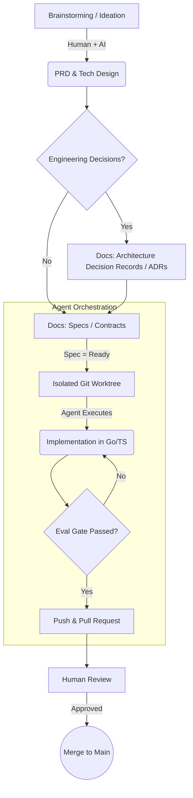

# Tech Recruiter Evaluator

_Last updated: June 2026_ • [Access the Application (AWS + Cloudflare)](https://techrecruiter.syntelix.ia.br)

<p align="center">
  
  
  
</p>

> The **Tech Recruiter Evaluator** is an AI-native technical maturity scanner designed for recruiters. It cross-references job requirements with evidence extracted from resumes (PDF), GitHub, LinkedIn, and portfolios.

The core philosophy of this product is to be **evidence-first** and **human-reviewed**. It **does not issue scores, rankings, or approval/rejection verdicts**. Instead, it organizes technical findings into a clear evidence matrix and formulates targeted behavioral/technical questions (STAR) for the technical interview.

---

## 🚀 Roadmap & Evolution (Risk-ordered Tiers)

The project is executed in risk-based vertical slices:

- ✅ **Tier 0 (Walking Skeleton)**: Go + `chi` router, `JSON-first` data contracts (mirrored with TypeScript), Vite+React skeleton.
- ✅ **Tier 1 (Mock-mode Demo)**: Deterministic mock pipeline with SSE Events, testing the end-to-end flow in the UI without spending actual AI tokens.
- ✅ **Tier 2 (First Real Reasoning)**: Text-only LLM pipeline connected via `LLMClient` to Gemini models. Agents for profiling, evidence matching, and matrix formatting.
- ✅ **Tier 3 (Evidence Ingestion)**:
  - `GitHub-lite`: Fast static analysis of public repositories.
  - `Go-native PDF extraction`: Local parsing of resumes and texts.
  - `Portfolio mini-crawler`: Bounded HTML content extraction.
- ✅ **Tier 4 (Cloud & Deploy)**: Dockerized API, Frontend build, and infrastructure provisioned via AWS App Runner, AWS Amplify, and Proxy/DNS on Cloudflare.
- 🚧 **Stretch / Future**: Deep GitHub code sampling (AST/Tree-sitter), database persistence for reports, multi-user login, and MCP/Claude Code extensions.

---

## 🏗️ Architecture & Engineering

### 1. The Asynchronous Agent Pipeline
A strictly controlled 9-agent flow that acts like an assembly line, ensuring consistency and mitigating hallucinations from unconstrained models:
1. `JobProfileAgent`: Interprets the job posting to define the expected seniority and stack.
2. `ResumeEvidenceAgent` / `LinkedInEvidenceAgent` / `PortfolioEvidenceAgent`: Specialists in extracting claims from raw sources.
3. `GitHubEvidenceAgent`: Evaluates metadata, stacks, and static quality in public repositories.
4. `EvidenceCheckerAgent` & `QuadrantClassifierAgent`: Cross-reference claims against evidence and categorize them in the Evidence Matrix (Strong/Weak vs. Validated/Pending).
5. `STARQuestionAgent`: Formulates behavioral/technical questions to cover validation "gaps".
6. `TechnicalMaturityAnalystAgent`: Creates the executive summary and formats the final JSON and Markdown export.

### 2. The Backend (Go API)
- **Engine**: Go + `chi` router, running *stateless* and *in-memory* operations for the MVP.
- **Integration & UX**: Agent progress is streamed to the Frontend via **Server-Sent Events (SSE)** (`GET /api/analyses/{id}/events`).
- **Security**: PDF processing and repository crawling happen in-memory within the machine/container, without unnecessarily uploading candidate files to the cloud or public LLMs.

### 3. The Frontend (React + Vite)
- **Modern SPA**: No complex routing (no React Router for the MVP), state managed purely via `useReducer`.
- **Design System**: The UI/UX is built from scratch using CSS *Design Tokens* (`design/`), ensuring professional visual consistency focused on the recruiter's readability.

### 4. Infrastructure: Docker, AWS, and Cloudflare
The deployment follows **ADR-0007**, designed for high availability, native auto-scaling, and edge protection.
- **Mutable Images**: The API is packaged into a lean `linux/amd64` Docker image.
- **AWS App Runner**: Runs the API image exposing HTTPS traffic on port `8080`, pulling the isolated `GOOGLE_API_KEY` secret from AWS Secrets Manager.
- **AWS Amplify**: The Frontend is statically hosted via CDN, built by injecting the AWS `VITE_API_BASE_URL` at compilation time.
- **Edge Proxy (Cloudflare)**: Custom domain (`techrecruiter.syntelix.ia.br`) under Cloudflare (Proxy *Full Strict* mode) routing traffic simultaneously to Amplify (app) and App Runner (api).

---

## 🧭 Spec-Driven Development (SDD) Methodology

This project does not rely on "free-form coding" by AI. All development follows a rigorously scripted flow. Code foundation only happens **after** human approval of a contract (Spec).



### The Golden Rules of our Methodology
1. **Agent Isolation (ADR-0016 / ADR-0015)**: Agents work in isolated `git worktrees` (e.g., `.worktrees/spec-008`). This prevents file collisions and enables parallel development.
2. **Contracts before Code (ADR-0014)**: Not a single line of code is written without a corresponding `spec` in the `Ready` state.
3. **Offline & Deterministic Evaluation**: The merge filter (`gate.ps1`) is 100% offline and runs locally. This protects `main` from regressions and unwanted AI token usage.
4. **Architecture Decision Records (ADRs)**: We use ADRs (`docs/adr/`) to avoid "black boxes". Decisions like *Evidence-first without Final Score* (ADR-0002) or *Go-native PDF extraction* (ADR-0017) are documented to provide traceable rationale for every technical choice.

---

## 💻 Local Development

The repository adopts an isolated parallelism flow and strict *gatekeeping* via Automated L0/L1/L2 Tests.

**Requirements**: Go 1.22+, Node.js 20+, Docker.

1. **Clone and Install**
   ```bash
   git clone https://github.com/CafeSemCafeina/avaliador-tech-recruiter.git
   cd avaliador-tech-recruiter
   ```
2. **Running the API (Mock Mode)**
   In `mock` mode (Default), the API responds perfectly, deterministically, and immediately, simulating the AI response. Useful for debugging the Visual Interface.
   ```bash
   cd backend
   go run ./cmd/server
   ```
3. **Running the API (Real Gemini Mode)**
   Create a `.env` in `backend/` with `ANALYSIS_MODE=gemini` and your API key (`GOOGLE_API_KEY`), or use Google Cloud Workload Identity/Vertex ADC.
4. **Starting the Frontend**
   In another terminal:
   ```bash
   cd frontend
   npm ci
   npm run dev
   ```

*(To package into a container quickly, there is a `docker-compose.yml` file that spins up both fronts).*

---

## 🎯 Our Non-Negotiable Technical Principles

1. **Never give a final score**: Emitting numeric rankings or dictating "Approved/Rejected" is prohibited. Only data supports human decisions.
2. **Absence of evidence is not proof of inability**: If there is no project on GitHub validating "React", this is not a negative point; a *STAR Question* is generated for technical validation during the interview.
3. **Evidence-first**: Every candidate *claim* must be traceable to its source (CV, LinkedIn, GitHub).
4. **Mock Floor Protected**: The deterministic test pipeline must run 100% green locally and offline. No PR is merged without passing `gate.ps1`.

---

## 📂 Repository Map

- 📂 `backend/`: Go code, API routes, tests, and Agent orchestration.
- 📂 `frontend/`: Single Page Application in React.
- 📂 `design/`: Design System and primary CSS Tokens.
- 📂 `docs/` and `specs/`: PRDs, Execution Plans, and ADRs (Architectural Decisions). The single source of truth for what should or should not be coded.
- 📂 `orchestration/`: Scripts and `git worktree` automations for parallelization across AI agents/Multiple developers.
