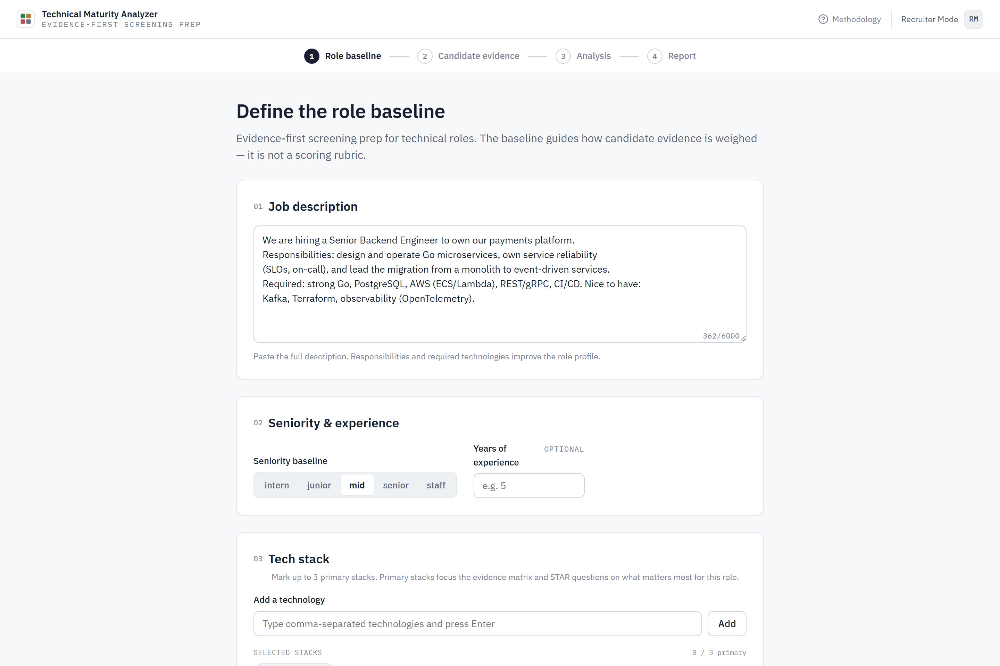
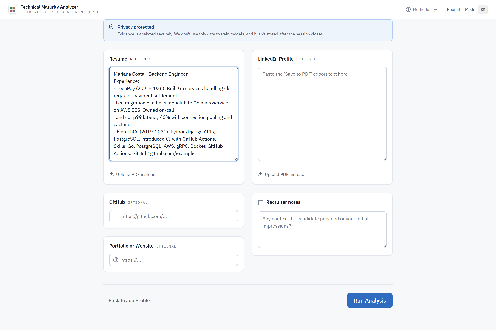
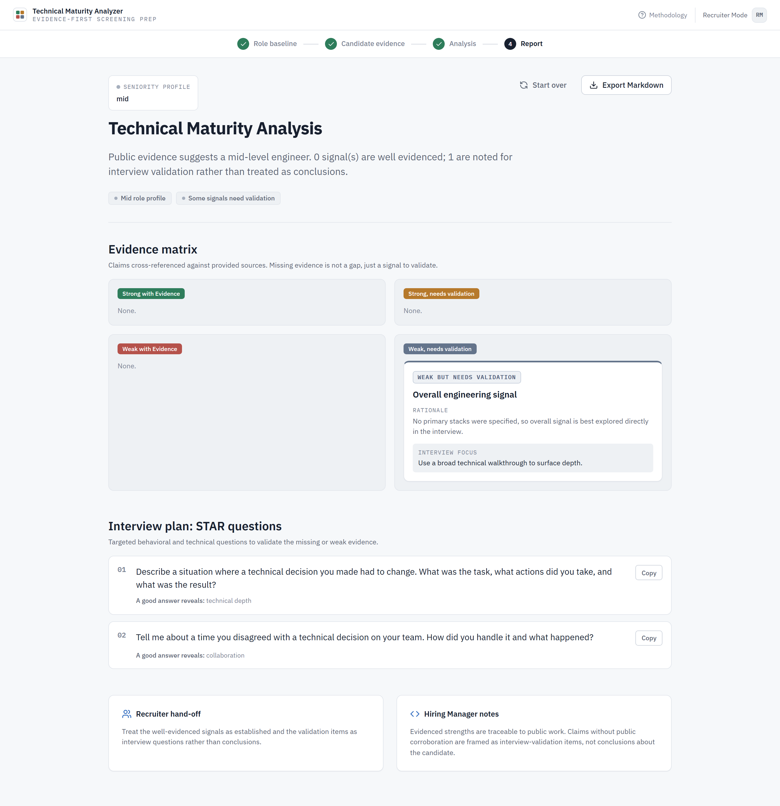
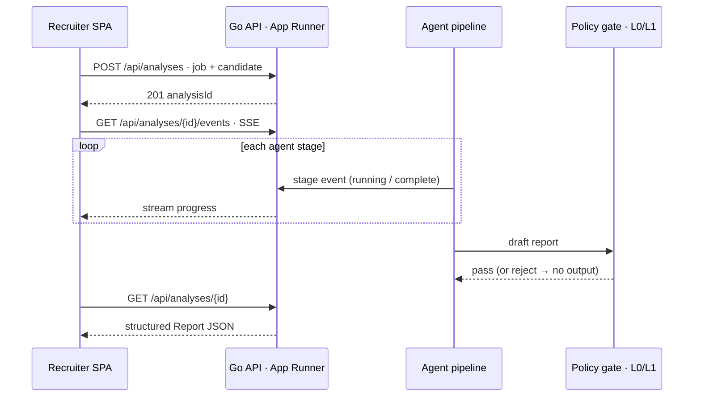
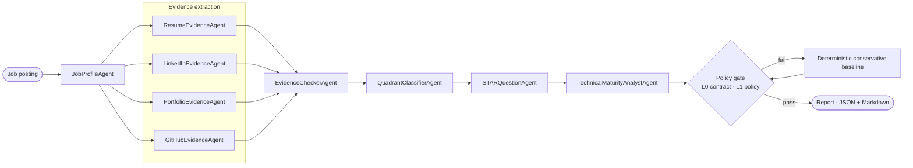
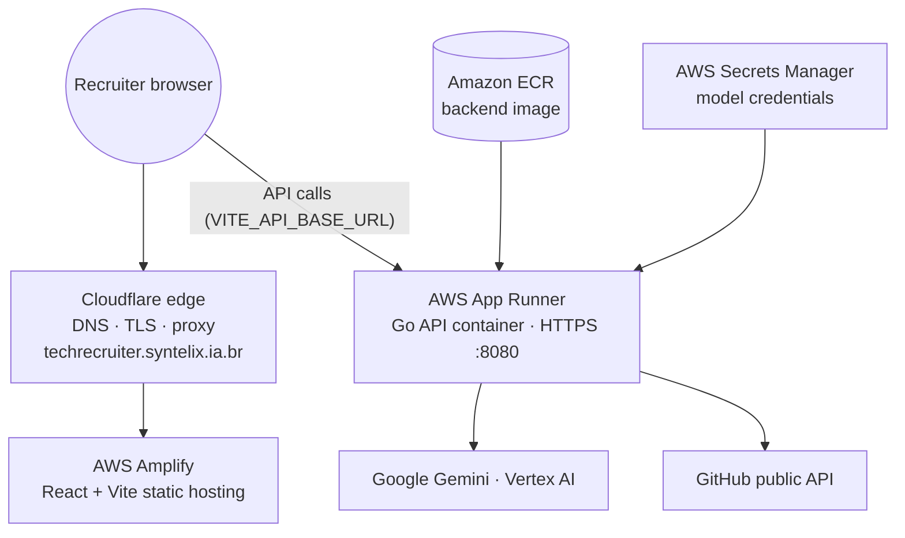
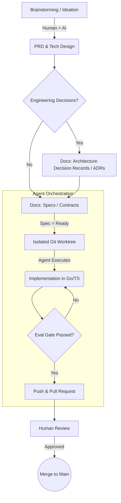

# Tech Recruiter Evaluator

_Last updated: June 2026_ • **[🔗 Open the live app (AWS + Cloudflare)](https://techrecruiter.syntelix.ia.br)**

<p align="center">
  
  
  
  
</p>

> An **AI-native technical-maturity scanner for recruiters**. It cross-references a job's requirements with evidence pulled from résumés (PDF), GitHub, LinkedIn, and portfolios — then hands the recruiter a structured **evidence matrix** and a set of targeted **STAR interview questions**.

The product has one opinionated stance that shapes every design decision: it is **evidence-first** and **human-reviewed**. It deliberately **never emits a score, a ranking, or an automated decision verdict**. Instead of pretending to judge a person, it organizes what the public record *does* and *does not* show, and turns every missing signal into something to validate in the interview — not a strike against the candidate. The "no final score" rule isn't a guideline; it is **machine-enforced** by an offline policy gate that rejects forbidden vocabulary, unsupported conclusions, and numeric fit values ([ADR-0002](docs/adr/0002-evidence-first-no-final-score.md), [Evaluation strategy](docs/EVALUATION.md)).

---

## 📸 Product tour

The recruiter moves through four steps — **Role baseline → Candidate evidence → Analysis → Report**. The analysis streams agent-by-agent over Server-Sent Events, and the report is rendered from structured JSON (never by parsing Markdown).

**1 · Role baseline** — describe the role, seniority, and the stacks that matter most.


**2 · Candidate evidence** — paste a résumé and link public sources; uploaded files are processed in-memory and are not persisted after the session.


**3 · Evidence-first report** — an evidence matrix (strong/weak × evidenced/needs validation), STAR questions for unresolved signals, and separate recruiter / hiring-manager hand-offs. No score, by design.


---

## 🏗️ Architecture & engineering

### Runtime request flow

The frontend never blocks on the analysis: it kicks off a job, subscribes to a live SSE stream of agent progress, then fetches the structured report when the run completes.



### The agent pipeline

Analysis is **not** a free-form autonomous agent. It is a strictly ordered nine-stage assembly line: reasoning stages use an `LLMClient` seam, while public-source ingestion uses bounded, read-only fetchers ([ADR-0003](docs/adr/0003-controlled-go-native-agent-pipeline.md)). This keeps the workflow testable, makes degraded fallbacks explicit, and limits unconstrained model behavior. Every final report must clear the policy gate before it is returned.



| Stage | Agents | Role |
| --- | --- | --- |
| Profile | `JobProfileAgent` | Reads the posting → expected seniority & stack |
| Extract | `Resume` / `LinkedIn` / `Portfolio` / `GitHubEvidenceAgent` | Pull verifiable claims from each raw source |
| Cross-check | `EvidenceCheckerAgent` · `QuadrantClassifierAgent` | Match claims to evidence; place each in the matrix |
| Interview | `STARQuestionAgent` | Generate questions to validate unresolved signals |
| Synthesize | `TechnicalMaturityAnalystAgent` | Executive summary + final JSON / Markdown export |

### Cloud topology

Deployment follows **[ADR-0007](docs/adr/0007-aws-amplify-and-container-backend.md)**: a static frontend on a CDN, a portable containerized API, and Cloudflare at the edge.



- **Backend** — lean `linux/amd64` Docker image on **App Runner**, stateless and in-memory for the MVP, streaming progress over SSE. PDF parsing and bounded repo crawling stay in-process; in real mode, extracted text is sent to the configured Gemini / Vertex backend for analysis.
- **Frontend** — React + Vite SPA (no router, state via `useReducer`), built from a CSS design-token system (`design/`) and hosted on **Amplify** with `VITE_API_BASE_URL` injected at build time.
- **Edge** — **Cloudflare** terminates TLS and proxies the custom domain.

---

## 🚀 Roadmap & evolution (risk-ordered tiers)

The project is built in risk-first vertical slices — the deterministic mock demo is a *protected floor* that must stay green before any real dependency is added.

- ✅ **Tier 0 — Walking skeleton**: Go + `chi`, JSON-first contracts mirrored 1:1 in TypeScript, Vite + React shell.
- ✅ **Tier 1 — Mock-mode demo**: deterministic pipeline with SSE progress; the full UX flow runs end to end with zero AI spend.
- ✅ **Tier 2 — First real reasoning**: text-only LLM agents via `LLMClient` → Gemini (profiling, evidence matching, matrix formatting).
- ✅ **Tier 3 — Evidence ingestion**: `GitHub-lite` static repo analysis · Go-native PDF extraction · bounded portfolio mini-crawler.
- ✅ **Tier 4 — Cloud & deploy**: Dockerized API + static frontend on AWS App Runner / Amplify, fronted by Cloudflare.
- 🚧 **Stretch**: deep GitHub code sampling (AST / Tree-sitter), report persistence, multi-user login, MCP / Claude Code extensions.

---

## 🧭 Spec-driven development (SDD)

No "free-form coding" by AI. Implementation only begins **after** a human approves a contract (Spec), and a change only merges once the offline eval gate is green.



### The golden rules

1. **Agent isolation ([ADR-0016](docs/adr/0016-git-flow-branch-pr-worktree.md) / [ADR-0015](docs/adr/0015-agent-orchestration-tooling.md))** — agents work in isolated `git worktrees` (e.g. `.worktrees/spec-008`), enabling collision-free parallel development.
2. **Contracts before code ([ADR-0014](docs/adr/0014-spec-layer-implementation-contracts.md))** — not a line is written without a corresponding `spec` in the `Ready` state.
3. **Offline, deterministic evaluation** — the merge filter (`gate.ps1`) is 100% offline and local, protecting `main` from regressions and unwanted token spend.
4. **Architecture Decision Records** — decisions like *evidence-first without a final score* ([ADR-0002](docs/adr/0002-evidence-first-no-final-score.md)) or *Go-native PDF extraction* ([ADR-0017](docs/adr/0017-go-native-pdf-extraction.md)) are documented to keep traceable rationale and avoid black boxes.

---

## 💻 Local development

**Requirements**: Go 1.22+, Node.js 20+, Docker (optional).

```bash
git clone https://github.com/CafeSemCafeina/avaliador-tech-recruiter.git
cd avaliador-tech-recruiter
```

Run the two processes in separate terminals:

```bash
# Terminal 1 — API in deterministic mock mode (no AI spend)
cd backend && go run ./cmd/server          # :8080

# Terminal 2 — frontend dev server (calls VITE_API_BASE_URL, default :8080)
cd frontend && npm ci && npm run dev        # :5173
```

- **Real Gemini mode**: copy `backend/.env.example` to `backend/.env`, set `ANALYSIS_MODE=gemini` and either a `GOOGLE_API_KEY` (Developer API) or Vertex ADC / `GOOGLE_CREDENTIALS_JSON`.
- **One-command stack**: `docker compose up --build` spins up both the API and the frontend together.

---

## 🎯 Non-negotiable principles

1. **Never a final score** — numeric rankings or "approved/rejected" are prohibited; data supports human decisions, it doesn't replace them.
2. **Absence of evidence ≠ inability** — no public React project doesn't count against the candidate; it becomes a *STAR question* to validate live.
3. **Evidence-first** — every claim is traceable to its source (CV, LinkedIn, GitHub).
4. **Protected mock floor** — the deterministic pipeline must run 100% green, locally and offline; nothing merges without passing `gate.ps1`.

---

## 📂 Repository map

| Path | Contents |
| --- | --- |
| `backend/` | Go API, routes, tests, and the agent orchestration |
| `frontend/` | React single-page application |
| `design/` | Design system and CSS tokens |
| `docs/` · `specs/` | PRD, execution plan, ADRs — the single source of truth for what may be coded |
| `orchestration/` | `git worktree` automation for parallel AI-agent / multi-dev work |
